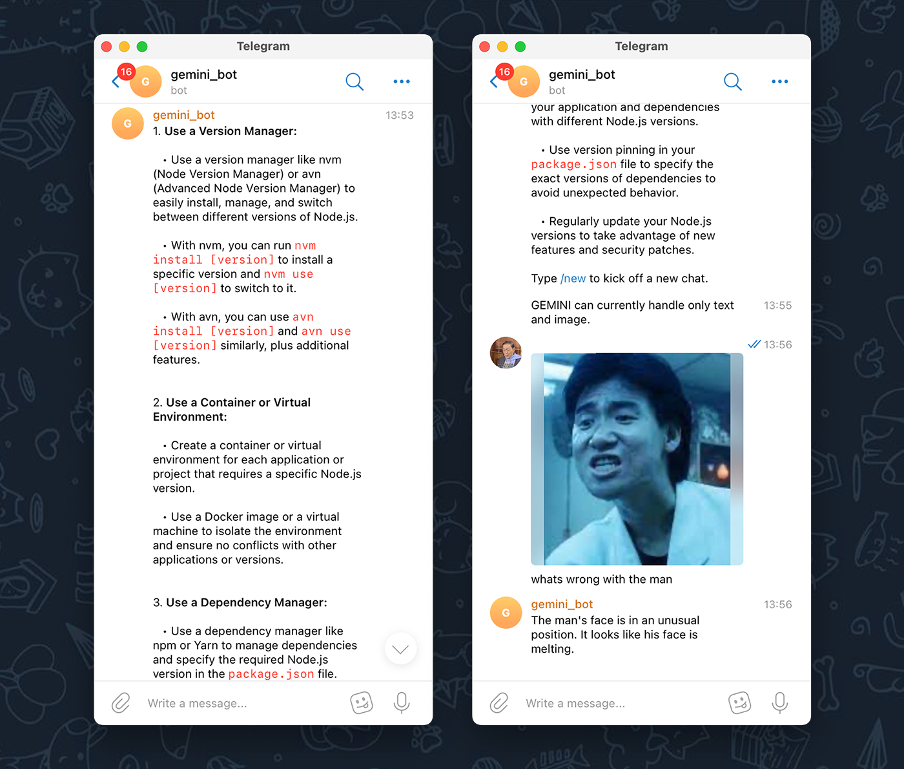
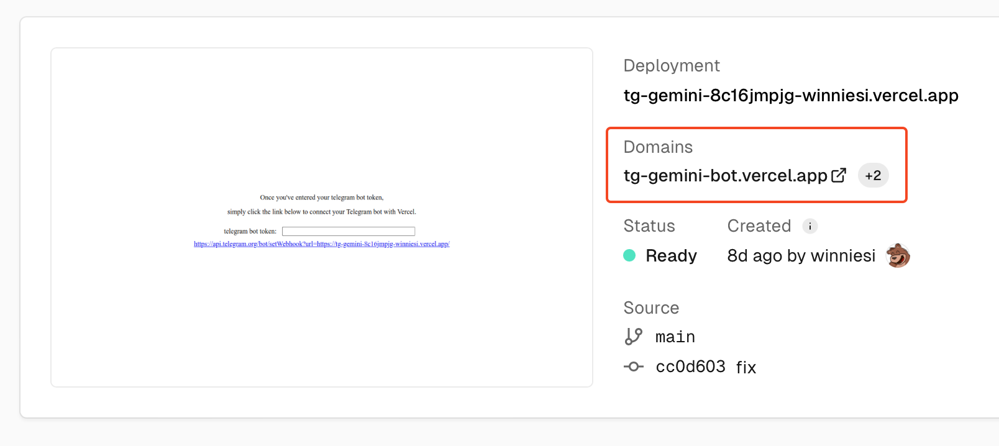
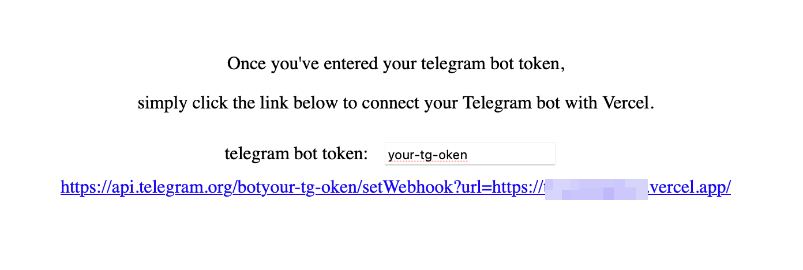
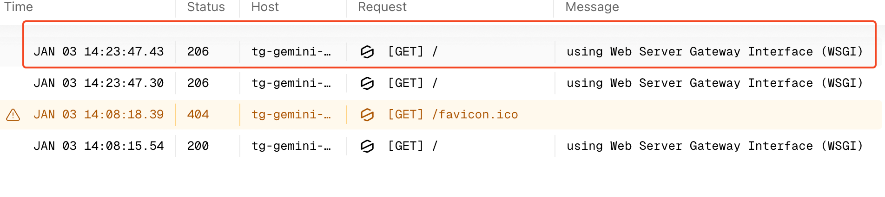

# tg-gemini-bot

[EN](README.md) | [简中](README_zh-CN.md) 

The tg-gemini-bot let's you use Google Gemini services right on your personal Telegram bot.

Super easy, just a single click and you've got it set up on Vercel.

🚀 If you don't want to deploy it yourself, you can use this deployment-free telegram bot: [GeminiBot](https://t.me/geminipro_api_bot). This bot is a fork from this project, providing completely identical features.

## Features

- This is built with Flask - super straightforward and easy to develop.
- It's an all front-end project, and you can get it up and running on Vercel with just one click.
- Supports Gemini continuous conversation. (Due to Vercel's restrictions, conversations may not be saved for a long time)
- Supports both Gemini text, image interface, and telegram markdown.

## Preparation

Get these things ready, and then fill them in as environment variables in Vercel.

- **GOOGLE_API_KEY**

  apply for your Google gemini pro api: https://makersuite.google.com/app/apikey

- **BOT_TOKEN**

  create your own telegram bot ([check the tutorial](https://flowxo.com/how-to-create-a-bot-for-telegram-short-and-simple-guide-for-beginners/)), obtain the token of the bot, which is in the format similar to: `67295022320:AAHmfuSQb0ZoUq0ycNPvgzqCCX7I1uzzaSE`

- **allowed USERS or GROUPS**

  Collect the user or group IDs that have access to this bot. You can separate them using any symbol in `,，;；` or spaces.

  You can also turn off authentication so everyone and groups can use it

  [learn more](#environment-variable)

## Get Started

1. Click  to deploy to Vercel.

2. **Set the environment variable** according to the instructions below.

3. Once everything's done, visit the domain name of your Vercel project address. (Visiting the `Domains` instead of the `Deployment Domains` provided by Vercel for the project .)

   Or you could just click on `https://api.telegram.org/bot<bot-token>/setWebhook?url=<vercel-domain> ` to connect your Telegram bot to Vercel services. (remember to replace `<token>` and `<vercel-domain>` with your actual corresponding parameters)

4. Fill in your telegram bot token on the page to associate telegram bot and vercel.

## Environment Variable

| Environment Variable | Required | Description                                                                                                                            |
| -------------------- | --- | -------------------------------------------------------------------------------------------------------------------------------------- |
| GOOGLE_API_KEY       | YES | Your Google gemini pro api, it looks like `AI2aS4Cl55F9ni9WN84Qn_KWRSuqXvUWkPq6kovc `                                                  |
| BOT_TOKEN            | YES | The Telegram bot token you applied for, it looks like `67295022320:AAHmfuSQb0ZoUq0ycNPvgzqCCX7I1uzzaSE`                                |
| ALLOWED_USERS        | No | List the allowed user's Telegram usernames. If there's more than one person, you can separate them using any symbol in `,，;；` or spaces. and it should look like: `name1,name2`.Including the `@` symbol is optional, so either `ohmorningsir` or `@ohmorningsir` is acceptable. No need to be case sensitive. If you do not set a username, you can use id instead. use `/get_my_info` to get. |
| ALLOWED_GROUPS | No | List the allowed group's Telegram usernames. If there's more than one person, you can separate them using any symbol in `,，;；` or spaces. and it should look like: `group1,group2`.Including the `@` symbol is optional, so either `ohmorningsirs_group` or `@ohmorningsirs_group` is acceptable. No need to be case sensitive. If it is a private group, you can use id instead. use `/get_group_info` to get. |
| ADMIN_ID | No | ten-digit telegramID. If you want to enable debug mode, this value must be set correctly. |
| IS_DEBUG_MODE | No | Whether to enable debug mode. `0` to disable. `1` to enable. Default is `0` . |
| AUCH_ENABLE | No | `0` to disable auth. Anyone can use this bot. `1` to enable auth. Default is `1` . |
| GROUP_MODE | No | `1` to use common chat history in groups, `2` to record chat history individually for each person. Default is `1` . |

Tip: After modifying the environment variables, you need to redeploy them to take effect. You need to enter the internal console of the Vercel project, click the `Deployments` button at the top, select the `···` button to the right of the top item in the list, not the button directly to the right of the "Deployments" title! click `Redeploy` to redeploy.

## Command list
`/new` Start a new chat

`/get_my_info` Get personal information

`/get_group_info` Get group information (group only)

`/get_allowed_users` Get the list of users that are allowed to use the bot (admin only)

`/get_allowed_groups` Get the list of groups that are allowed to use the bot (admin only)

`/list_models` list_models (admin only)

`/get_api_key` Get the list of gemini's apikeys. It is currently useless. Multiple keys may be added automatically in the future. (admin only)

`/help` Get help

`/5g_test` :)

## Group use

Invite the robot to the group and add it as an administrator. The robot will respond to all messages in the group. Otherwise, it will only respond to messages related to the robot. To use it, you need to @robot or reply to any message sent by the robot.

Currently, topic groups are not well supported, and all messages sent by the robot will be sent in General.

## How to figure out what's wrong

So, if you've done everything step by step just like we talked about and your Telegram bot is still not doing its thing, then it's a good idea to poke around the Vercel logs to see what's up.

1. Open your project in vercel, click on the **Deployments** tab, check whether the deployment is successful, if there is an error, please modify according to the error prompt.

2. If no errors have occurred here, open the **Logs** tab, click on an erroneous log, and the program's output will be displayed on the right.

3. If there are any error messages, you can open an issue, and then provide the error information.
