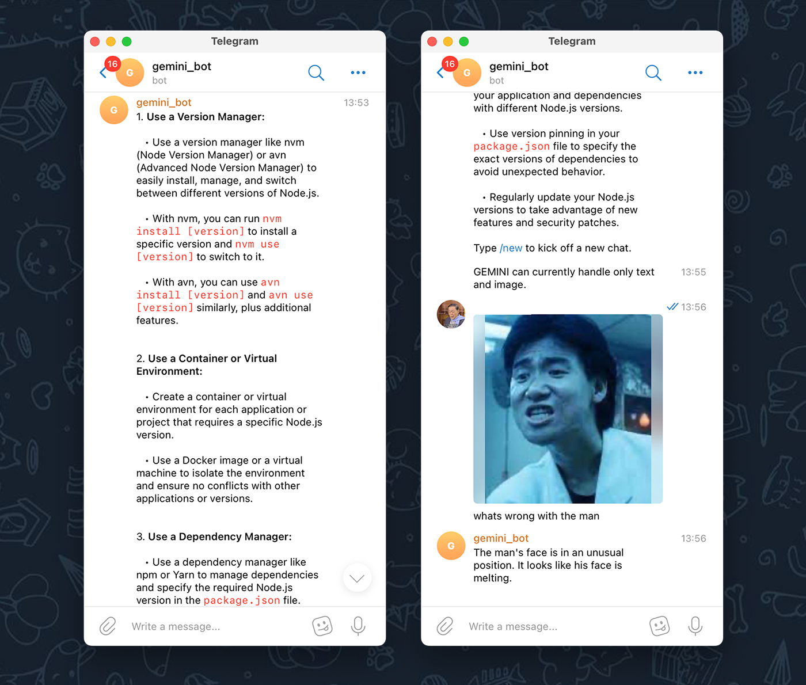
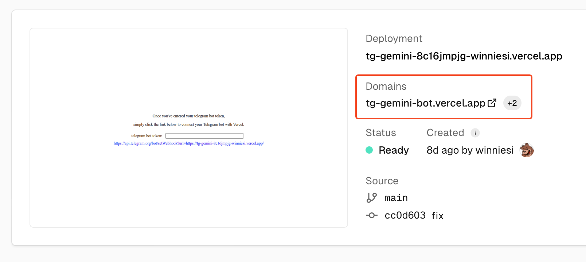
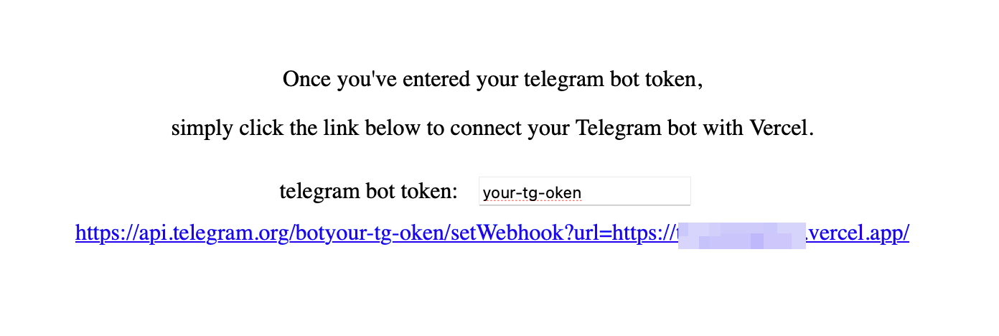
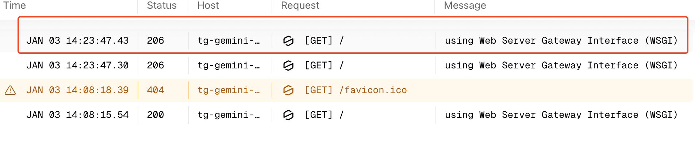

# tg-gemini-bot

[EN](README.md) | [简中](README_zh-CN.md)

基于 Google Gemini 的个人 Telegram 机器人，一键部署到 Vercel。

## 功能

- 文本对话，支持上下文记忆（用 `/new` 重置）
- 多媒体支持：图片、视频、音频、语音消息、视频消息
- 回复媒体消息可用自定义 prompt
- 通过 `SYSTEM_INSTRUCTION` 设置系统指令 — 自定义机器人性格
- 默认模型 `gemini-2.5-flash`（约1秒响应），可运行时切换
- 等待响应时显示输入状态
- 基于 Telegram ID 的访问控制
- 支持多个 Google API Key 自动轮询

## 支持的媒体

| 类型 | 发送方式 | 无文字时的默认 prompt |
|------|---------|---------------------|
| 图片 | 发送图片 | "describe this picture" |
| 视频 | 发送视频文件 | "describe what is happening in this video" |
| 音频 | 发送音频文件 | "transcribe this audio" |
| 语音 | 录制语音消息 | "transcribe this audio" |
| 视频消息 | 录制圆圈视频 | "describe what is happening in this video" |

**自定义 prompt：** 发送媒体时附带文字说明，将覆盖默认 prompt。

**回复媒体：** 回复任意媒体消息并附上文字 — Gemini 会用你的文字作为 prompt 来处理该媒体。例如，回复一张照片问"这辆车是什么颜色？"，或回复一条语音说"用3个词总结"。

## 快速开始

1. 点击  部署到 Vercel。

2. 设置环境变量（见下方）。

3. 访问 Vercel 项目的**域名**（不是 Deployment Domain）来注册 Webhook，或手动访问：

   `https://api.telegram.org/bot<bot-token>/setWebhook?url=<vercel-domain>`

   

4. 在页面上填写 Bot Token 完成关联。

   

## 环境变量

| 变量 | 必填 | 说明 |
|------|------|------|
| GOOGLE_API_KEY | 是 | Google Gemini API Key，支持多个（逗号分隔自动轮询）。前往 [Google AI Studio](https://makersuite.google.com/app/apikey) 申请。 |
| BOT_TOKEN | 是 | Telegram Bot Token，从 [@BotFather](https://t.me/BotFather) 获取。 |
| ALLOWED_USERS | 是 | 允许使用的 Telegram 用户 ID，多个用逗号分隔。在机器人中使用 `/get_my_info` 获取你的 ID。 |
| SYSTEM_INSTRUCTION | 否 | 自定义系统指令，定义机器人性格和行为。 |
| GEMINI_MODEL | 否 | 默认模型，默认 `gemini-2.5-flash`。可通过 `/set_model` 运行时切换。 |

> **注意：** 仅支持私聊，不支持群组。

## 命令

| 命令 | 说明 |
|------|------|
| `/new` | 开始新对话（清除上下文） |
| `/set_model <模型名>` | 切换 Gemini 模型 |
| `/get_model` | 查看当前模型 |
| `/list_models` | 列出可用模型 |
| `/get_my_info` | 获取你的 Telegram ID |
| `/help` | 显示帮助 |

## 使用技巧

- **对话记忆：** 机器人会记住聊天历史，用 `/new` 开始新对话。
- **冷启动：** Vercel 免费版闲置后首条消息可能需要几秒，之后会很快。
- **给媒体加 prompt：** 不要只发图片 — 加上文字说明如"翻译图中的文字"效果更好。
- **回复追问：** 对 Gemini 的回答不满意？回复原始媒体发一个新问题。
- **多 API Key：** 在 `GOOGLE_API_KEY` 中用逗号分隔多个 Key，自动轮询避免限流。
- **修改环境变量后：** 需在 Vercel 重新部署（Deployments → ⋯ → Redeploy）才生效。

## 故障排查

1. **机器人没响应？** 检查 Vercel **Deployments** 选项卡是否有构建错误。
2. **部署成功但没反应？** 打开 **Logs** 选项卡，发一条测试消息，查看错误信息。
3. **还是不行？** 提交 [Issue](https://github.com/winniesi/tg-gemini-bot/issues) 并附上错误日志。

